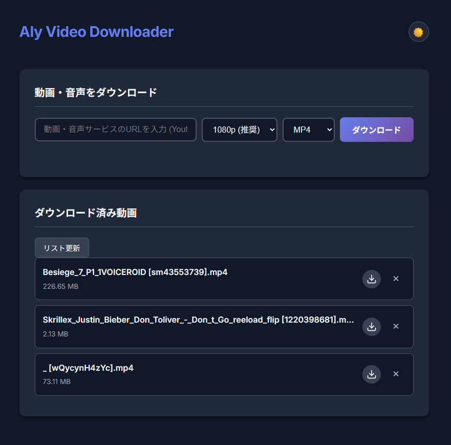

# Aly Video Downloader

RustとVanilla JSで構築された、モダンで強力なユニバーサル動画ダウンローダー。
スピード、安定性、そしてプレミアムなユーザー体験を重視して設計されています。



## ✨ 特徴

- **ユニバーサル対応**: YouTube, SoundCloud, Twitch, Twitterなど、多数のサイトから動画や音声をダウンロード可能（`yt-dlp`を使用）。
- **モダンなUI**: ダークテーマを採用した洗練されたインターフェース。レスポンシブデザインとスムーズなアニメーションを搭載。
- **フォーマット選択**: 動画（MP4）と音声（MP3）の切り替え、画質（4K, 1080p, 720pなど）の選択が可能。
- **リアルタイム進捗**: すべてのダウンロード状況をリアルタイムなプログレスバーで表示。
- **堅牢なアーキテクチャ**:
  - **Rustバックエンド**: Actix-webを使用した高性能な非同期サーバー。
  - **スマートキュー**: 複数のダウンロードをフリーズすることなく並列処理。
  - **Cookieサポート**: ブラウザのCookieを使用してYouTubeのbot検出を回避。

## 🚀 始め方

### 前提条件

- **Rust**: 最新の安定版
- **yt-dlp**: インストール済みでPATHが通っていること
- **FFmpeg**: 動画の結合や音声変換に必要
- **Node.js**: `yt-dlp`のJavaScript実行に必要

### インストール手順

1. リポジトリをクローン:
   ```bash
   git clone https://github.com/Aly3424/aly-video-downloader.git
   cd aly-video-downloader
   ```

2. プロジェクトをビルド:
   ```bash
   cargo build --release
   ```

3. サーバーを起動:
   ```bash
   ./target/release/youtube_downloader
   ```

4. ブラウザでアクセス:
   `http://localhost:3000`

## 🛠️ 設定

- **Cookie**: YouTubeのダウンロードを有効にするには、ルートディレクトリに `youtube-cookies.txt` を配置してください。
- **ポート**: デフォルトではポート3000で動作します。

## 📦 技術スタック

- **Backend**: Rust, Actix-web, Tokio
- **Frontend**: HTML5, CSS3 (Variables, Flexbox/Grid), Vanilla JavaScript
- **Core**: yt-dlp, FFmpeg

## 📝 ライセンス

このプロジェクトはオープンソースです。
